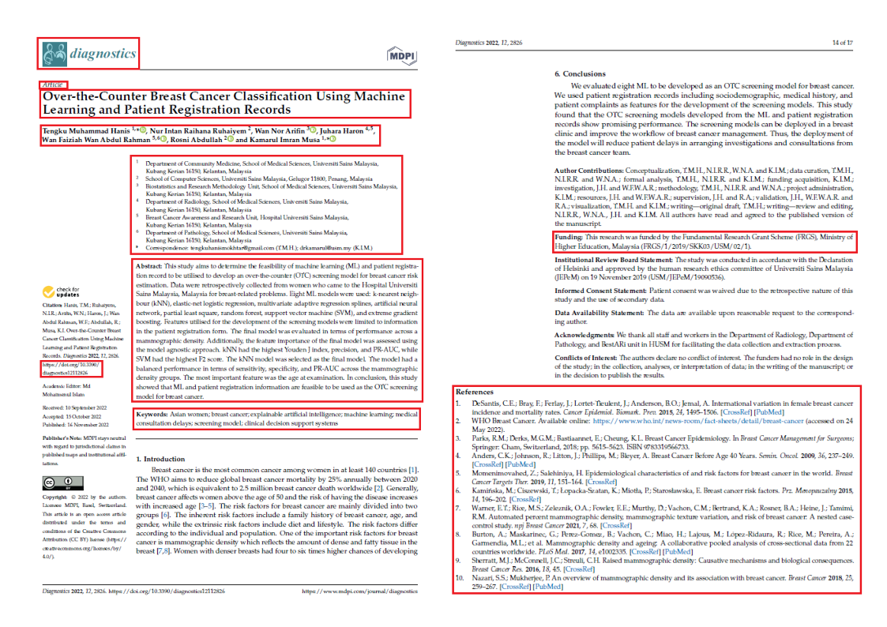
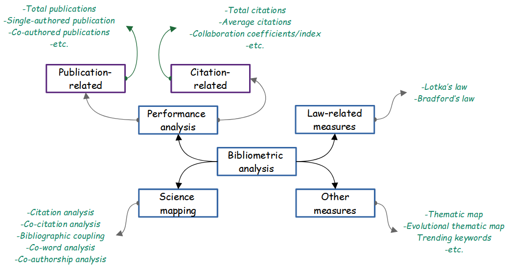

name: about-me
layout: false
class: about-me-slide, inverse, middle, center

## About me

```{r R conf logo, echo=FALSE}
xaringanExtra::use_logo(
  image_url = "figs/R_MY.jpg", 
  width = "60px",
  height = "70px"
)
```


### Tengku Muhammad Hanis Mokhtar

#### MBBCh, MSc (Medical Statistics), <br>PhD Student (Public Health Epidemiology)

.fade[Universiti Sains Malaysia<br>Kelantan, Malaysia]

[`r fontawesome::fa("link")` tengkuhanis.netlify.app](https://tengkuhanis.netlify.app/)
[`r fontawesome::fa("twitter", a11y = "sem")` @tmhanis](https://twitter.com/tmhanis)
[`r fontawesome::fa("github", a11y = "sem")` @tengku-hanis](https://github.com/tengku-hanis)<br>
[`r fontawesome::fa("linkedin", a11y = "sem")` @Tengku Muhammad Hanis](https://www.linkedin.com/in/tengku-muhammad-hanis-9a7222144/)

---

## What is biliometrics?

- Basically, an analysis of bibliographic information
- What we can do with bibliometric analysis:
  - Evaluate research progress
  - Quantitatively summarise research output
  - "Mapping" research contributions by author, institution, etc
  - Explore research trends
- When to do a bibliometric?
  - Too many literature
  - The scope (research question) is broad
  
---

## Bibliographic information

```{r biblio_info, echo=FALSE, fig.align='center', out.width='76%'}

```

---

## Type of analysis

```{r analysis, echo=FALSE, fig.align='center', out.width='90%'}

```

---
class: middle, center
background-color: white

## Bibliometrics using bibliometrix

---

## Data

- Data was downloaded from the [Scopus](https://www.scopus.com/search/form.uri?display=basic&clear=t&origin=searchadvanced&txGid=f676aa0f046baff36a28dd0a11c7427e#basic) through USM's access
- Search terms used:  
  _**(TITLE("covid-19") OR TITLE("covid 19") OR TITLE("2019-nCov") OR TITLE("SARS-CoV-2") OR TITLE("2019 novel coronavirus")<br> OR TITLE("coronavirus disease 2019") OR TITLE("coronavirus disease-19")) AND (TITLE-ABS-KEY(Malaysia))**_
- The search result was further filtered into:
  1. Article
  2. Review 
  3. Conference paper
  4. data paper
- Final data - 1,265 papers

---

## Load packages

```{r setup, include=FALSE}
options(htmltools.dir.version = FALSE)
knitr::opts_chunk$set(echo = TRUE, message = FALSE, warning = FALSE, tidy = TRUE)
```

```{r packages}
library(tidyverse)
library(bibliometrix)
```

## Read data

Data should downloaded in a BibTex format for Scopus database

```{r read data, eval=FALSE}
dat <- convert2df("data/covid_msia.bib", dbsource = "scopus", format = "bibtex")
```

## Descriptive

```{r descriptive, eval=FALSE}
res <- biblioAnalysis(dat)
summary(res, k = 10)
```

`k` reflects the number of results to be displayed. Since the result is too long, the output is available [here](https://tengku-hanis.github.io/add_rconf2022/).

---

## Basic plots

```{r descriptive hidden, echo=FALSE, results='hide', fig.show='hide'}
dat <- convert2df("data/covid_msia.bib", dbsource = "scopus", format = "bibtex")
res <- biblioAnalysis(dat)
bp <- plot(res, k = 10)
```

```{r basic plots1, echo=TRUE, eval=FALSE}
plot(res, k = 10)
```

```{r panelset, echo=FALSE}
xaringanExtra::use_panelset()
```

.panelset.sideways[
.panel[.panel-name[**Plot 1**]
```{r basic plots2, echo=FALSE, out.width='80%', fig.align='center'}
bp$MostProdAuthors
```
]

.panel[.panel-name[**Plot 2**]
```{r basic plots3, echo=FALSE, out.width='80%', fig.align='center'}
bp$MostProdCountries
```
]

.panel[.panel-name[**Plot 3**]
```{r basic plots4, echo=FALSE, out.width='80%', fig.align='center'}
bp$AnnualScientProd
```
]

.panel[.panel-name[**Plot 4**]
```{r basic plots5, echo=FALSE, out.width='80%', fig.align='center'}
bp$AverArtCitperYear
```
]

.panel[.panel-name[**Plot 5**]
```{r basic plots6, echo=FALSE, out.width='80%', fig.align='center'}
bp$AverTotCitperYear
```
]
]

---

## Collaborations

.panelset.sideways[
.panel[.panel-name[Institutions]
```{r collab plot1, out.width='45%', fig.align='center'}
# Create network
MT <- metaTagExtraction(dat, Field = "AU_CO", sep = ";")
country_collab <- biblioNetwork(MT, analysis = "collaboration",  network = "universities")

# Plot network
set.seed(123)
networkPlot(country_collab, n = 20, cluster = "none", Title = "Institutions collaboration", type = "circle", size.cex = T)
```
]

.panel[.panel-name[Countries]
```{r collab plot2, out.width='45%', fig.align='center'}
# Create network
country_collab <- biblioNetwork(MT, analysis = "collaboration",  network = "countries")

# Plot network
set.seed(123)
networkPlot(country_collab, n = 20, cluster = "none", Title = "Countries collaboration", type = "circle", size.cex = T)
```
]
]

---

## Lotka's law

Lotka's law describe the scientific productivity in certain research area.

```{r lotka}
L <- lotka(res)
L$p.value
```

Kolmogorov-Smirnov two sample test showed that there is a significant difference between the observed and theoretical distribution.

We can further plot the two distributions.

```{r lotka2}
# Theoretical distribution with Beta = 2
Theoretical <- 10^(log10(L$C)-2*log10(L$AuthorProd[,1]))

# Data wrangling for plotting
ldata <- 
  L$AuthorProd %>% 
  bind_cols(theory = Theoretical) %>% 
  pivot_longer(cols = c(Freq, theory), names_to = "distribution", values_to = "val_distr") %>% 
  mutate(distribution = as.factor(distribution), 
         distribution = fct_recode(distribution, Observed = "Freq", Theoretical = "theory"))
```

---

```{r lotka3 hidden, out.width='40%', fig.align='center'}
ggplot(ldata, aes(N.Articles, val_distr, color = distribution)) +
  geom_line(linewidth = 1) +
  labs(color = "Distribution:") +
  ylab("Frequency of authors") +
  xlab("Number of articles") +
  theme_minimal() +
  theme(legend.position = "top") +
  annotate("text", label = paste0("P-value = ", round(L$p.value, 3)), x = 12, y = 0.1, size = 4)
```

Lotka's law plot indicated that the observed distribution is significantly lower than the expected distribution.

---

## Trending keywords

```{r trending keywords, out.width='40%', fig.align='center'}
trend_kw <- fieldByYear(dat, field = "DE", timespan = c(2020,2022), min.freq = 5, n.items = 5, graph = FALSE) 
trend_kw$graph + theme_bw()
```

---

## Steps for bibliometric analysis

1. Define scope, objectives and selection criteria 
2. Specify techniques (based on objectives)
3. Comes up with search terms - always check with the databases whether the terms valid or not
4. Data searching on databases:
  - SCOPUS, WOS, Digital Science Dimensions, PubMed, Lens or Cochrane
5. Review downloaded data/abstracts if needed (brief review)
6. Run bibliometric analysis and report finding

---

## References

1. Donthu, N., Kumar, S., Mukherjee, D., Pandey, N., & Lim, W. M. (2021). How to conduct a bibliometric analysis: An overview and guidelines. Journal of Business Research, 133, 285–296. https://doi.org/10.1016/j.jbusres.2021.04.070
2. Aria, M., & Cuccurullo, C. (2017). bibliometrix : An R-tool for comprehensive science mapping analysis. Journal of Informetrics, 11(4), 959–975. https://doi.org/10.1016/j.joi.2017.08.007 
3. Hood, W.W., Wilson, C.S. The Literature of Bibliometrics, Scientometrics, and Informetrics. Scientometrics 52, 291 (2001). https://doi.org/10.1023/A:1017919924342 

---
class: center, middle

# Thanks!
```{r, echo=FALSE, out.width='15%', eval=FALSE}

```

.center[.footnote[`r fontawesome::fa("link")` Material: https://tinyurl.com/biblio-rconference2022]]
